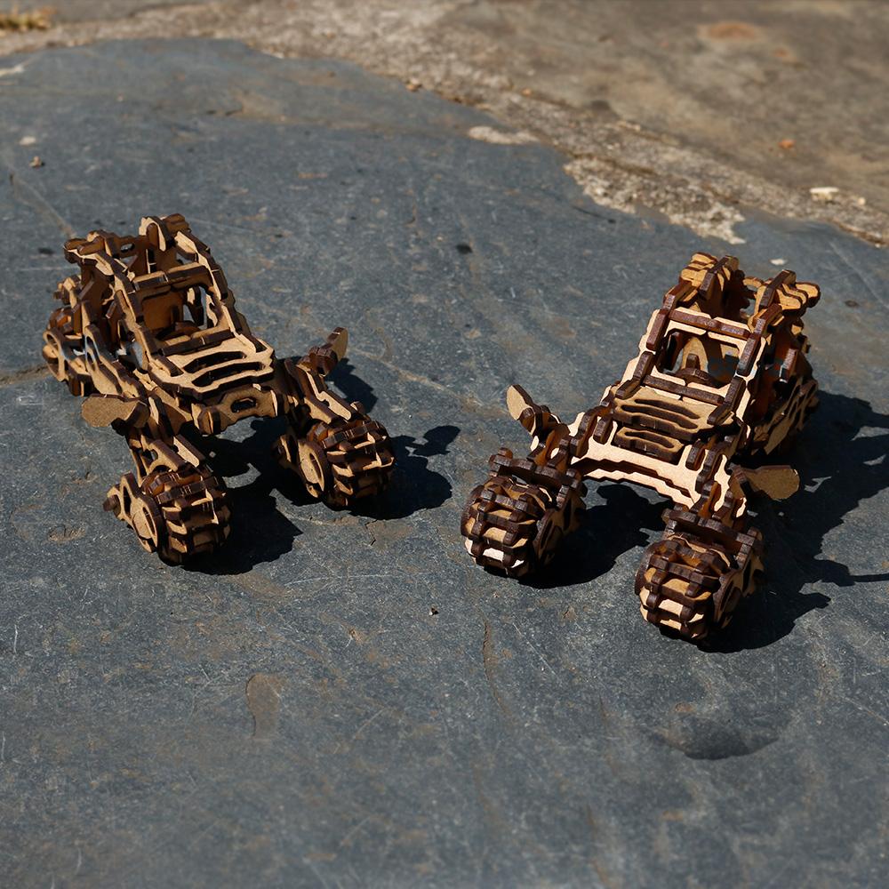

# Trike Buggy



More information and additional images:  
https://obuqdesign.wordpress.com/2024/05/22/trike-buggy/

<br>

## Details V1

| Property | Value |
|---|---|
| Type | Tridimensional model (pieces: 117) |
| Designed for | 3mm mdf or plywood |
| Design file format | DXF R14 |
| Dimensions | Height: 75mm; Length: 175mm; Width: 107mm |
| Frame | 130x220mm (x3) – ReadyToCut Layout |
| Units | mm |
| Scalable | Yes |

## Details V2
| Property | Value |
|---|---|
| Type | Tridimensional model (pieces: 105) |
| Designed for | 3mm mdf or plywood |
| Design file format | DXF R14 |
| Dimensions | Height: 75mm; Length: 160mm; Width: 107mm |
| Frame | 130x220mm (x3) – ReadyToCut Layout |
| Units | mm |
| Scalable | Yes |

<br>
<hr>
<br>

<div align="center">
  If you like this design and would like to support my work:
  <br><br>
  https://buymeacoffee.com/obuq
</div>

<br>
<hr>
<br>

<div align="center">

#### Thank you to all the patrons that supported me when this design was initially posted on Patreon

<br>

Roman Kupalov  
patreon person  
Wouter Simons  
Bob-Bob Bob-Bob  
Zak  
Julie Sturgeon  
Todd  
Rudenz Schulz  
Laura Culp  
Darkly Labs  
Aaron J Radke  
Renzo Ciarma  
Ray  
Robert Banks

</div>
```
